# Тестовое задание для бэкенд разработчика на Python в ITK academy. 
- Реализовать API используя FastAPI и Pydantic - с этим знаком очень слабо, `Лиана` сказала, что можно сделать на DRF, что я и сделал.

## Используемый стек:
- uv
- Python - 3.13
- DRF - 3.16.1
- Psycopg2-binary - 2.9.10
- Gunicorn - 23.0
- DRF-spectacular - 0.28
- Django-filter - 25.1
- Faker - 37.6 
- tqdm - 4.67.1
- pre-commit (линтер ruff)
- docker
---
## Запуск проекта с помощью Docker
1. Склонируйте репозиторий:
```bash
git clone https://github.com/meR1D1AN/test_itk.git
cd test_itk
```
2. Скопируйте файл `.env.sample` и внесите изменения в файл `.env`:
```bash
cp .env.sample .env
```
3. Проверьте, что программа Docker Desktop установлена и запущена, и введите команду:
```bash
docker compose up -d --build
```
4. При запуске контейнера в базе будет создан админ, можно будет перейти в админку Django, используя ADMIN_USERNAME и ADMIN_PASSWORD внесённые в файле `.env` и 10000 рандомных задач.
  
**Команда без передачи аргумента создаёт 10000 задач**
```bash
docker compose exec app uv run python3 manage.py create_test_data
```
**Команда с передачей аргумента создаст к примеру 12345 задач**
```bash
docker compose exec app uv run python3 manage.py create_test_data --count 12345        
```
5. Ссылка на [Админку](http://localhost/admin).
6. Сслыка на [Swagger](http://localhost/api/v1/docs) документацию.

---
### Ендпоинты
- Ручка GET на получение всех задач с фильтрацией по полям, и пагинацией 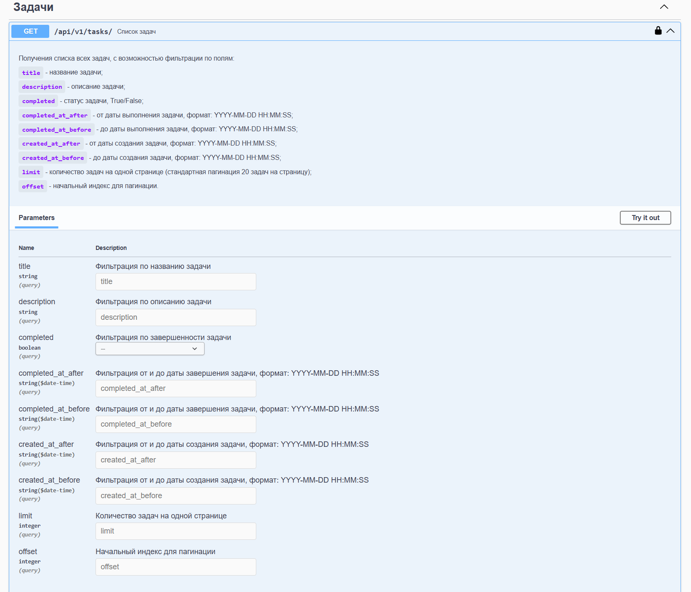
* пример успешного получения списка всех задач 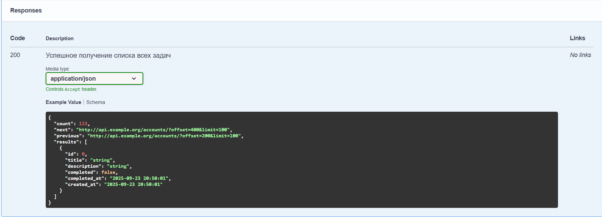

- Ручка POST на создание задачи 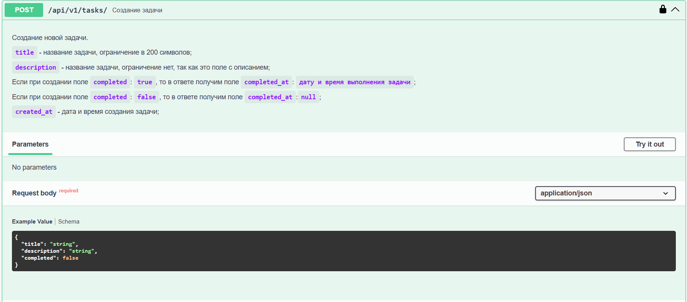
* пример успешного создания задачи, с возможными ошибками 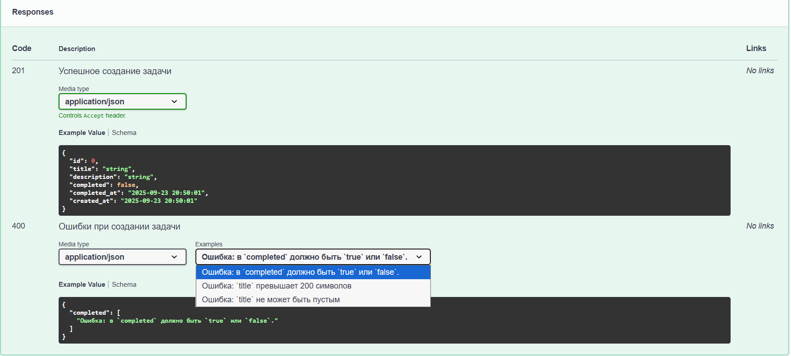

- Ручка GET id на получение детальной информации о задаче, необходимо передать ID задачи 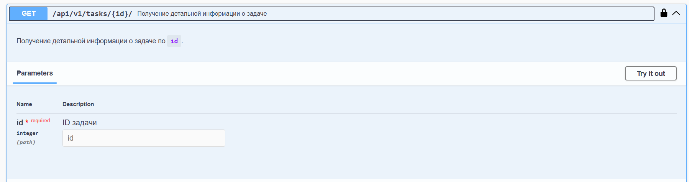
* пример успешного получение детальной информации о задаче, с возможными ошибками 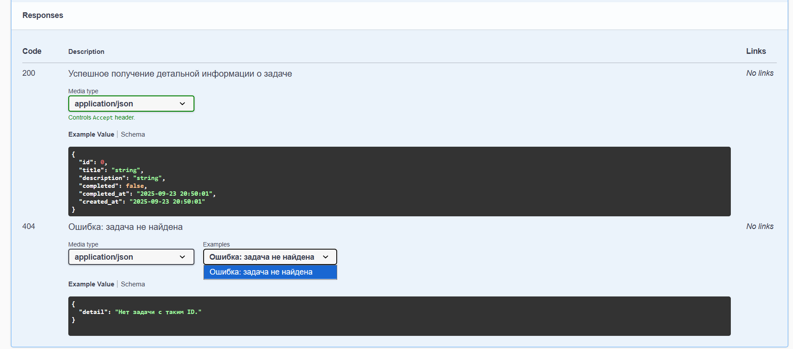

- Ручка PUT id полное обновление задачи, необходимо передать ID задачи 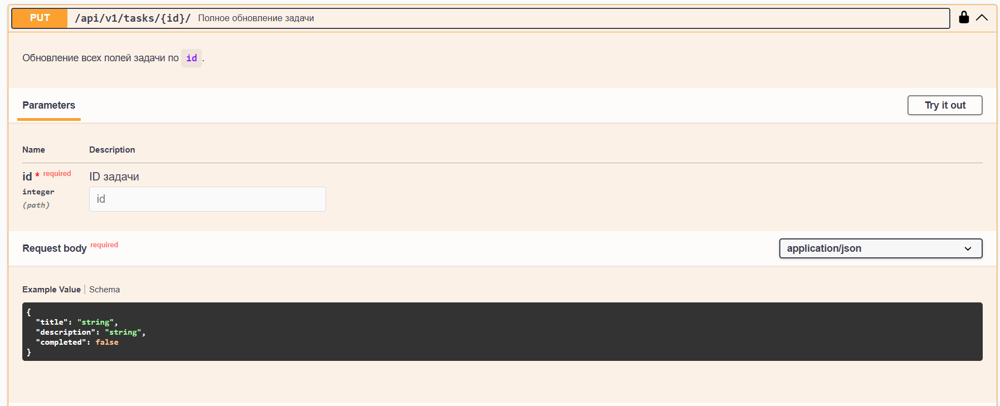
* пример успешного полного обновления задачи, с возможными ошибками 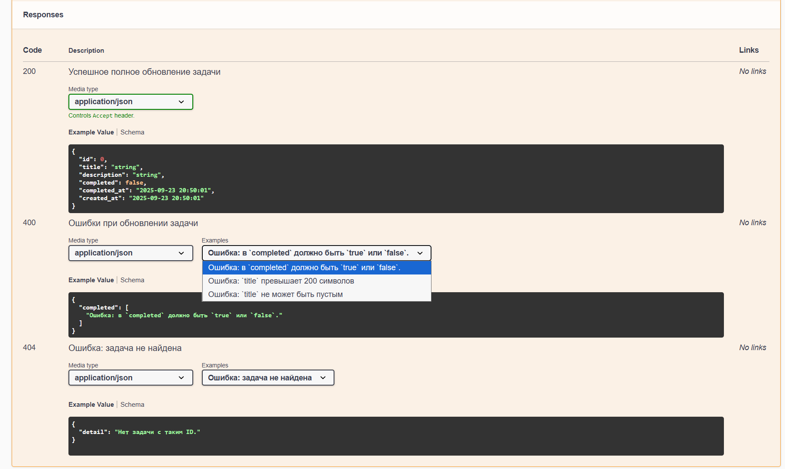

- Ручка PATCH id частичное обновление задачи, необходимо передать ID задачи 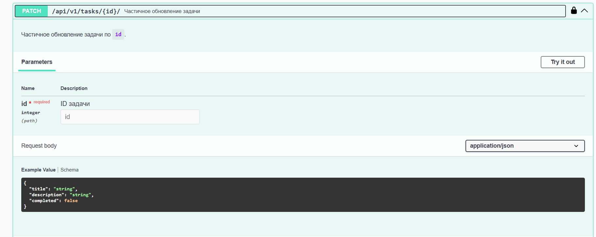
* пример успешного частичного обновления задачи, с возможными ошибками 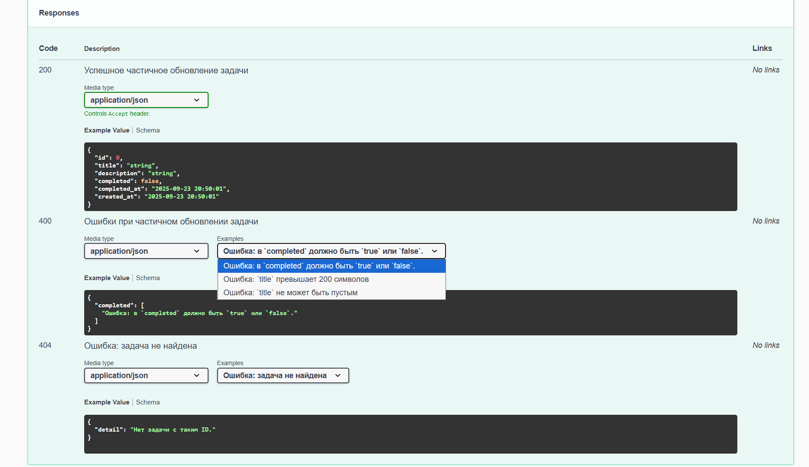

- Ручка DELETE id удаление задачи, необходимо передать ID задачи 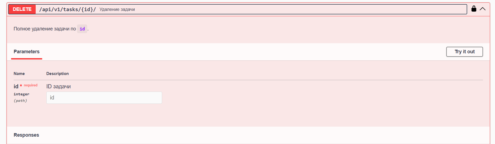
* пример успешного удаления задачи, с возможными ошибками 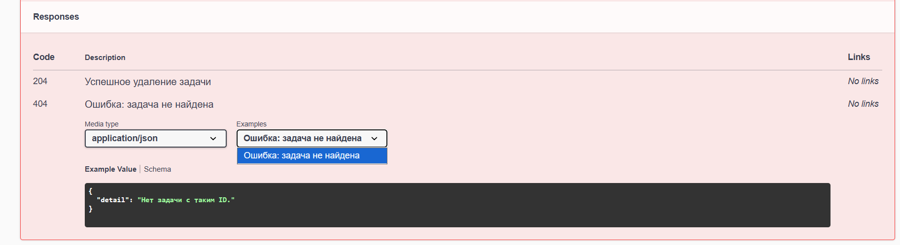
